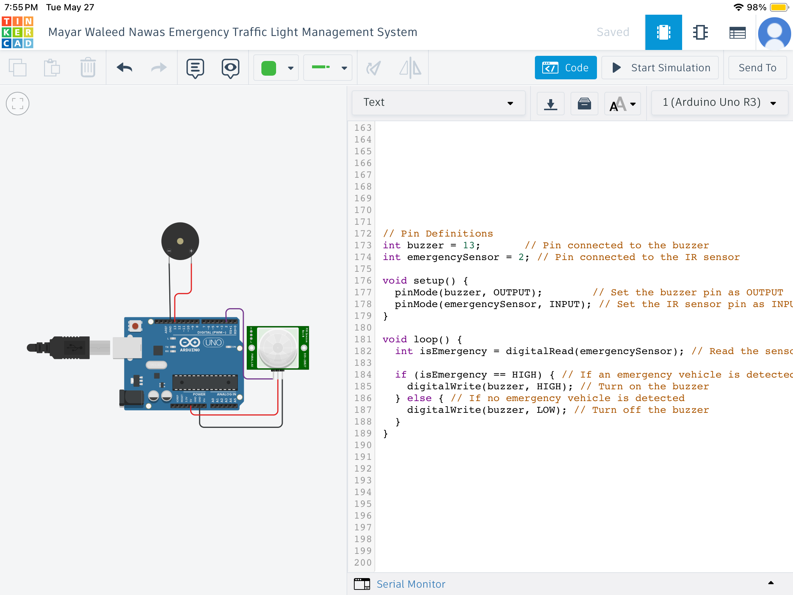
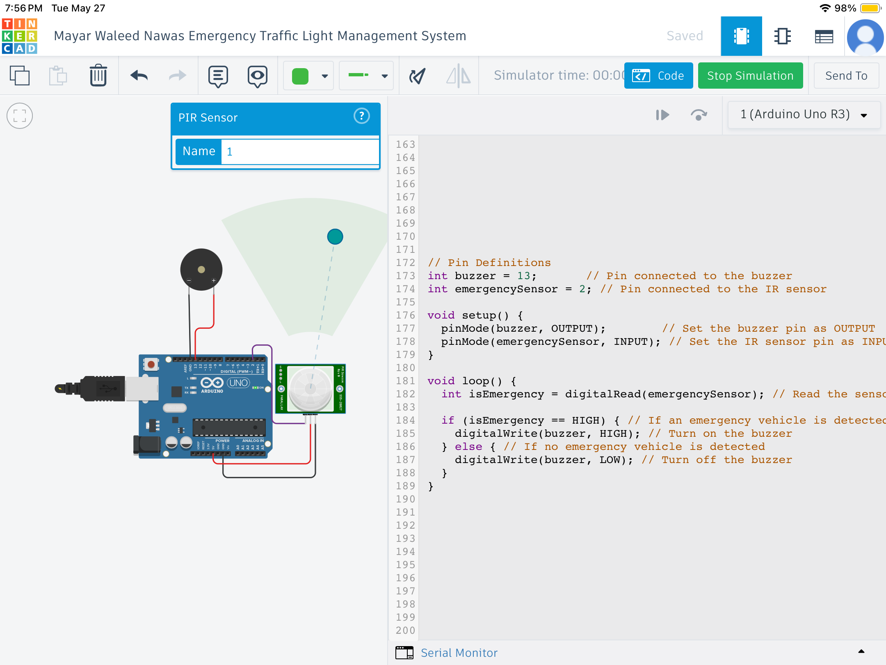
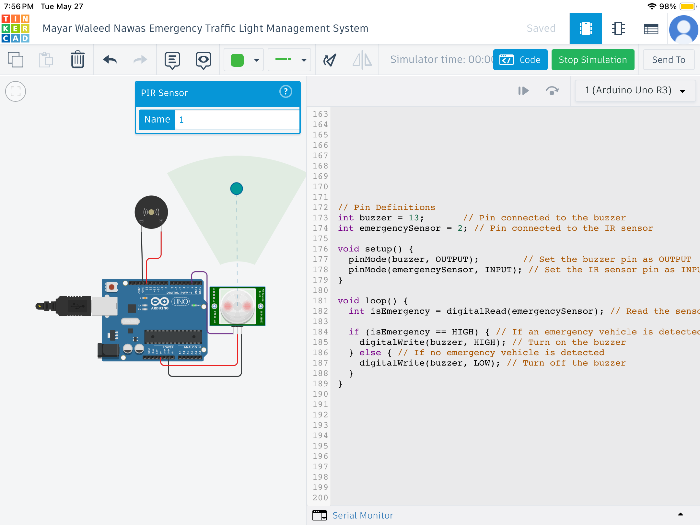

# 🚦 Traffic Light Management System (TLMS)

A smart traffic light control system using **Arduino Uno** and **IR sensor**, simulated via **Tinkercad**, designed to manage vehicle detection and automatic signal triggering using real-time inputs.

---

## 📦 Components Used

| Component             | Description                         |
|-----------------------|-------------------------------------|
| IR Sensor             | Smart Thing/Device (for detection)  |
| Arduino Uno R3        | Acts as IoT Gateway                 |
| Buzzer                | Acts as actuator (alarm)            |

---

## ⚙️ Simulation Steps

1. Connect the **IR sensor's VCC, GND, and Signal** pins to the appropriate Arduino pins.
2. Connect the **buzzer** to **digital pin 13** and **GND**.
3. Upload the provided Arduino code to the board inside Tinkercad.
4. Start the simulation and test detection by placing an object in front of the sensor.

---

## 🌐 Tinkercad Simulation

🔗 [Open Project in Tinkercad](https://www.tinkercad.com/things/KGAWGn8V3tR-traffic-/editel?sharecode=94LqdxVZLgp:whydyfE3sj2?BifTyhmnRiKCEZbYjAQ)

<iframe width="725" height="453" src="https://www.tinkercad.com/embed/kGAWGn8V3tR?editbtn=1" frameborder="0" marginwidth="0" marginheight="0" scrolling="no"></iframe>

---

## 📄 Project Report

📥 [Mayar Waleed Nawas 120220147 (TLMS)2.pdf](./Mayar%20Waleed%20Nawas%20120220147%20(TLMS)2.pdf)

---

## 🖼️ Project Image (Optional)

> Replace `project-image.png` with your actual image file name, or remove this section if no image is added.
